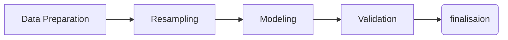

---
layout: post
title: Project 2. Prediction and classification with imbalanced dataset
categories: [projects, p2]
description: >
  Building prediction models for the imbalanced data
sitemap: false
---

The post will be elaborating the whole process and thoughts of my second project at the CRO.  Due to the privacy and confidential issue, the details on data set will not be provided. However, I am quite sure that you will get the gist of my work at the end of reading this post! The contents below will follow. 
 
1.  Introduction
2. Analysis Flow
3. Data Preparation
	* Resampling
4. Models
	* Hyperparameter tunings
5. Validation
	* Cross validation with SMOTE
6. Results and comments
{:toc}

## Introduction
Chronic Obstruction Pulmonary Disease(COPD) is a chronic inflammatory lung disease that causes obstructed airflow from the lungs. As it's *chronic*,   people want to find the ways to keep patients from the **acute** case. Under the same umbrella of the researches on the prevention, this project aims to build a accurate and practical prediction model. 

Amid all of the concerns on building decent prediction models, the main concerns on this project was *how to tackle the imbalanced problem*. Since the acute cases are relatively rare compared to the ordinary COPD cases, almost about 10-folds, some resampling methods are considered. 

## Analysis Flow

*put some comments on each process gurl*

## Data Preparation
It should be natural to introduce the data set in detail (for the sake of both credibility and  the convenience of explanation), however, it will not be provided in this post due to the privacy issue. All that I can provide for the further elaboration is that the data set contains almost every medical records of COPD patients in South Korea, which includes information on medications usage, symptoms, types of clinics, hospitalisations and so on. 

The final data set for the 

### Variable selection

### Resampling

## Models

tree-based

## Validation
### Cross validation with SMOTE
[Cross Validation]()

## Results and comments
